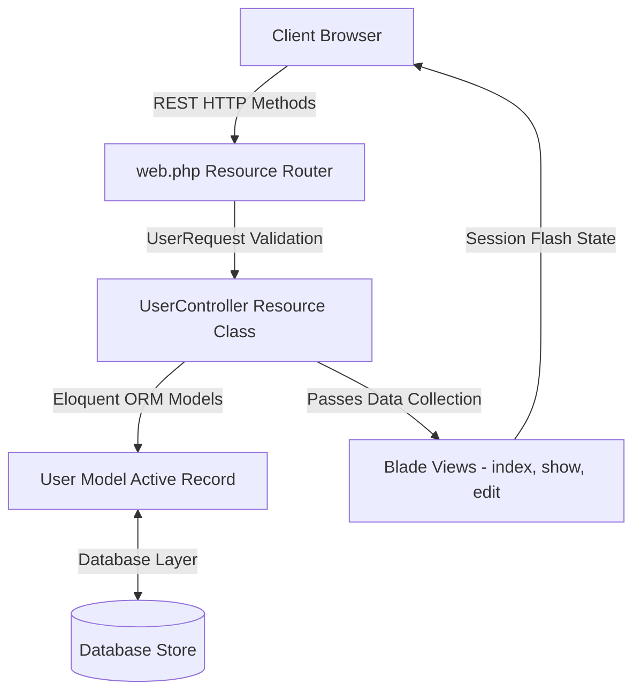

# Laravel Eloquent ORM & Resource CRUD Portal

A clean, production-ready implementation of unified resource routing and centralized database management using **Laravel 12** and **PHP 8.2+**. This project focuses on **Eloquent ORM** methodologies, illustrating object-relational abstraction for basic CRUD, pagination, custom input validation, session status alerts, and structured Bootstrap-styled Blade templates.

---

## 🛠️ Technology Stack & Dependencies


---

## 🚀 Key Features

*   **RESTful Resource Routing**: Configures entire route mappings using a single `Route::resource` registry declaration, managing index, create, store, show, edit, update, and destroy methods automatically.
*   **Eloquent ORM Abstraction**: Focuses on object-oriented active record commands (`User::paginate()`, `User::create()`, `User::find()` / `findOrFail()`, and `$user->delete()`).
*   **Encapsulated Request Policy**: Leverages custom request validation (`UserRequest`) to enforce validation rules (required name, email format, numeric age boundaries, and optional city defaults).
*   **Centralized Model Configurations**: Utilizes a clean `User` model, configuring factories, custom timestamps flags (`public $timestamps = false`), and guarded parameters overrides (`protected $guarded = []`).
*   **Active Session Feedback**: Sets flash messages (`with('status', '...')`) that render notification alerts on the UI upon record modifications.
*   **Blade Template Layouts**: Built on top of a base layout ([layout.blade.php](file:///d:/for%20CV/My%20learnings/Eloquent-Laravel/resources/views/layout.blade.php)) extending content slots to add, update, delete, list, and display individual user views.

---

## 📐 Application Architecture & Data Flow

This application is built with a classic RESTful resource pattern:



---

## 📂 Repository File Directory

```
Eloquent-Laravel/
├── app/
│   ├── Http/
│   │   ├── Controllers/
│   │   │   ├── Controller.php        # Base controller
│   │   │   └── UserController.php    # Resource Controller implementing Eloquent logic
│   │   └── Requests/
│   │       └── UserRequest.php       # Structured form validation policies
│   └── Models/
│       └── User.php                  # User Eloquent Model
├── database/
│   ├── migrations/                   # Table structures (users, cache, jobs)
│   └── seeders/                      # Database seed configurations
├── resources/
│   └── views/                        # Blade component views
│       ├── layout.blade.php          # Main Bootstrap base template wrapper
│       ├── home.blade.php            # Paginated user catalog listing view
│       ├── adduser.blade.php         # New user registration form
│       ├── updateuser.blade.php      # Existing profile editing form
│       └── showuser.blade.php        # Single user detailed view
├── routes/
│   ├── web.php                       # Single resource route definition
│   └── console.php                   # Command-line configuration settings
├── composer.json                     # Composer PHP dependency package list
└── vite.config.js                    # Asset build tool configurations
```

---

## 📝 Key Source Code Showcases

### 1. Unified Resource Controller ([UserController.php](file:///d:/for%20CV/My%20learnings/Eloquent-Laravel/app/Http/Controllers/UserController.php))
Demonstrates clean resource actions leveraging active Eloquent ORM calls:
```php
namespace App\Http\Controllers;

use App\Models\User;
use Illuminate\Http\Request;
use App\Http\Requests\UserRequest;

class UserController extends Controller
{
    public function index()
    {
        $users = User::paginate(5);
        return view('home', ['users' => $users]);
    }

    public function store(UserRequest $request)
    {
        User::create([
            'name' => $request->username,
            'email' => $request->useremail,
            'age' => $request->userage,
            'city' => $request->usercity,
        ]);

        return redirect()->route('user.index')
                         ->with('status', 'New User Added Successfully!');
    }

    public function show(string $user)
    {
        $users = User::findOrFail($user);
        return view('showuser', compact('users'));
    }

    public function update(UserRequest $request, string $user)
    {
        User::where('id', $user)
            ->update([
                'name' => $request->username,
                'email' => $request->useremail,
                'age' => $request->userage,
                'city' => $request->usercity,
            ]);

        return redirect()->route('user.index')
                         ->with('status', 'User Data Updated Successfully!');
    }

    public function destroy(string $id)
    {
        $user = User::find($id);
        $user->delete();

        return redirect()->route('user.index')
                         ->with('status', 'User Data Deleted Successfully!');
    }
}
```

### 2. Guarded Active Model ([User.php](file:///d:/for%20CV/My%20learnings/Eloquent-Laravel/app/Models/User.php))
Configures Eloquent to skip automatic timestamps and allows mass-assignment attributes:
```php
namespace App\Models;

use Illuminate\Database\Eloquent\Model;
use Illuminate\Database\Eloquent\Factories\HasFactory;

class User extends Model
{
    use HasFactory;
    
    // Disable Laravel default created_at & updated_at timestamp requirements
    public $timestamps = false;
    
    // Allow mass-assignment on all model fields
    protected $guarded = [];
}
```

---

## 💾 Relational Schema Definition

The database is built on a single core entity managed in [2025_07_26_103033_create_users_table.php](file:///d:/for%20CV/My%20learnings/Eloquent-Laravel/database/migrations/2025_07_26_103033_create_users_table.php):

### `users` Table
*   `id` (Big Integer, Auto-Increment Primary Key)
*   `name` (String, max 30 characters)
*   `email` (String, max 20 characters, unique index, nullable)
*   `age` (Unsigned Integer)
*   `city` (String, max 20 characters, nullable)

---

## 🚀 Setup & Execution Guide

### Prerequisites
Make sure the following are installed:
*   **PHP** version 8.2 or higher
*   **Composer** (PHP dependency manager)
*   An active database server (**MySQL / MariaDB**) or **SQLite** (configured inside your `.env` file).

### Installation & Run Steps
1.  **Clone the Repository**:
    ```bash
    git clone https://github.com/imtiazaly/Eloquent-Laravel.git
    cd Eloquent-Laravel
    ```
2.  **Install Composer Dependencies**:
    ```bash
    composer install
    ```
3.  **Create Environment Configuration**:
    Copy the example file to `.env`:
    ```bash
    cp .env.example .env
    ```
4.  **Generate Secure Application Key**:
    ```php
    php artisan key:generate
    ```
5.  **Configure Database**:
    Open the `.env` file and set up your preferred database configurations. For SQLite:
    ```env
    DB_CONNECTION=sqlite
    ```
6.  **Run Database Migrations**:
    Setup tables and migration registries:
    ```bash
    php artisan migrate
    ```
7.  **Start Local Development Server**:
    Run Laravel's internal server:
    ```bash
    php artisan serve
    ```
    Access the local application in your browser at `http://127.0.0.1:8000/user`.
